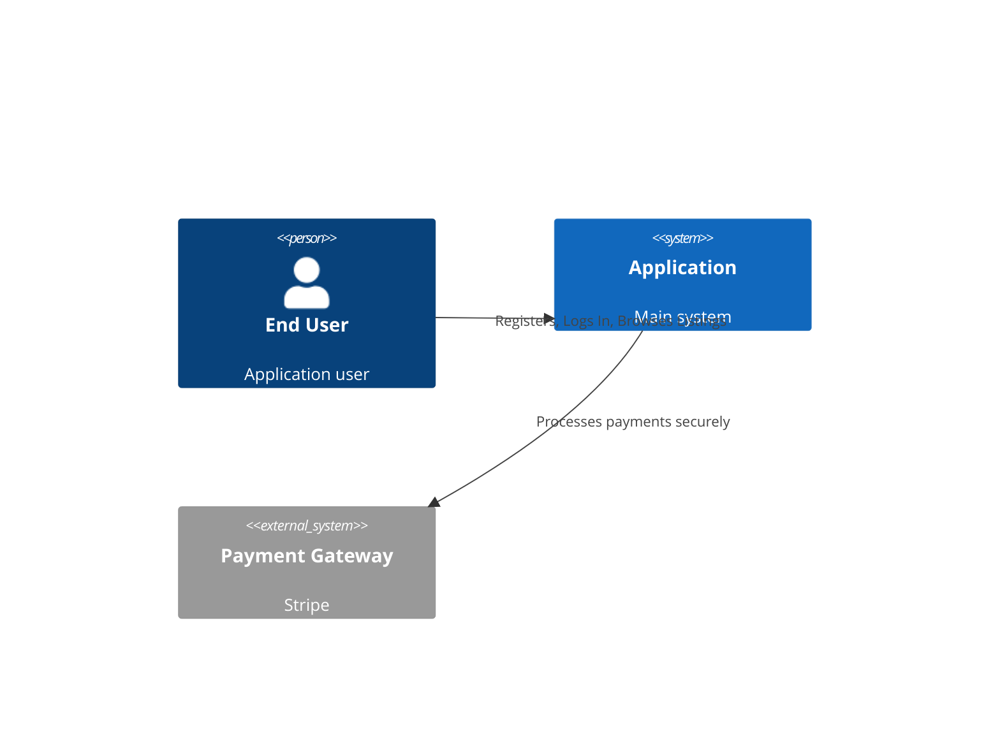
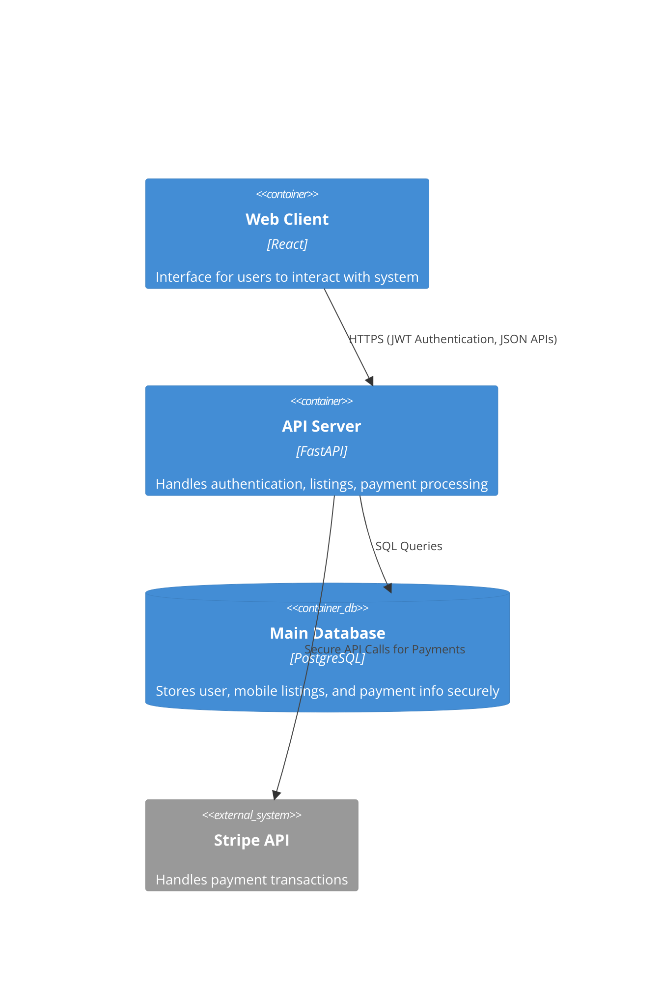

# System Architecture

## C4 Context Diagram

```mermaid
C4Context
  Person(user, "End User", "Application user")
  System(app, "Application", "Main system")
  System_Ext(payment, "Payment Gateway", "Stripe")
  Rel(user, app, "Registers, Logs In, Browses Listings")
  Rel(app, payment, "Processes payments securely")
```

## C4 Container Diagram

```mermaid
C4Container
  Container(web, "Web Client", "React", "Interface for users to interact with system")
  Container(api, "API Server", "FastAPI", "Handles authentication, listings, payment processing")
  ContainerDb(db, "Main Database", "PostgreSQL", "Stores user, mobile listings, and payment info securely")
  System_Ext(paymentGateway, "Stripe API", "Handles payment transactions")
  Rel(web, api, "HTTPS (JWT Authentication, JSON APIs)")
  Rel(api, db, "SQL Queries")
  Rel(api, paymentGateway, "Secure API Calls for Payments")
```